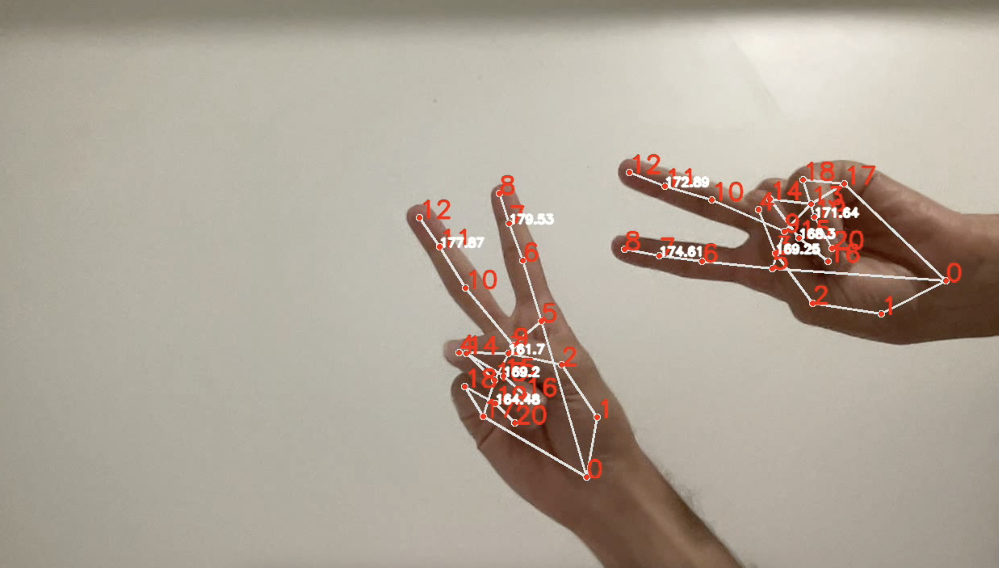

# Hand Tracking with MediaPipe and OpenCV

This project demonstrates hand tracking using MediaPipe and OpenCV in Python. It captures live video from a webcam or a video file, detects hand landmarks using MediaPipe's Hand Tracking module, calculates angles between finger joints, visualizes these angles on the video feed, and saves the angles data to a JSON file.


## Usage

1. **Clone the repository:**

    ```bash
   git clone https://github.com/HarisAmir/dfki.git
   cd dfki
   ```
2. **Create Conda environment:**

    ```bash
    conda create --name hand_detection python=3.x
    conda activate hand_detection
    pip install -r requirements.txt
    ```
3.  **Run the script:**

    ```bash
    python detection.py
    ```
   
## Output

1. **output.mp4**: This file contains the video output with hand tracking visualization.

2. **output_angles.json**: This JSON file contains the hand angles data computed during the video processing.


